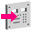
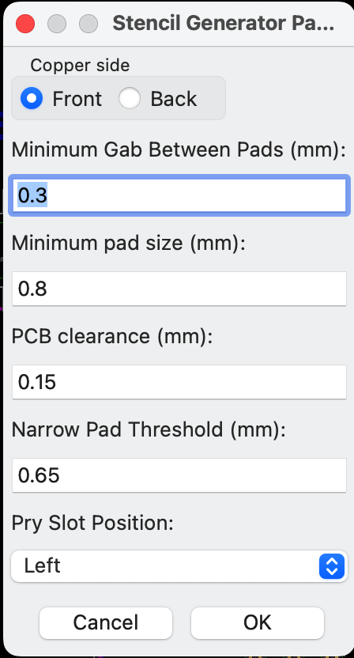
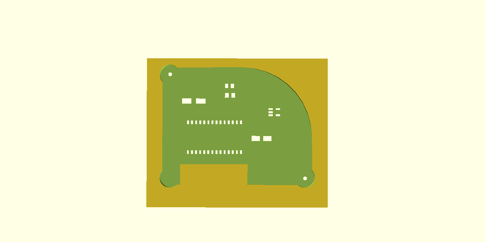
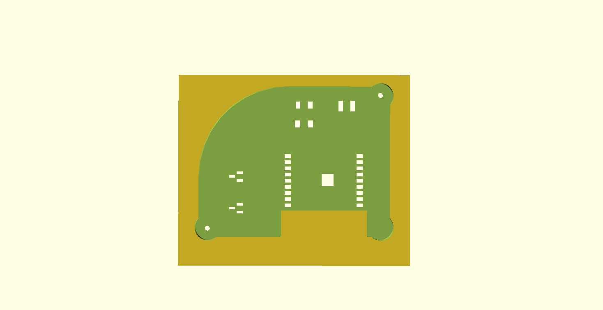
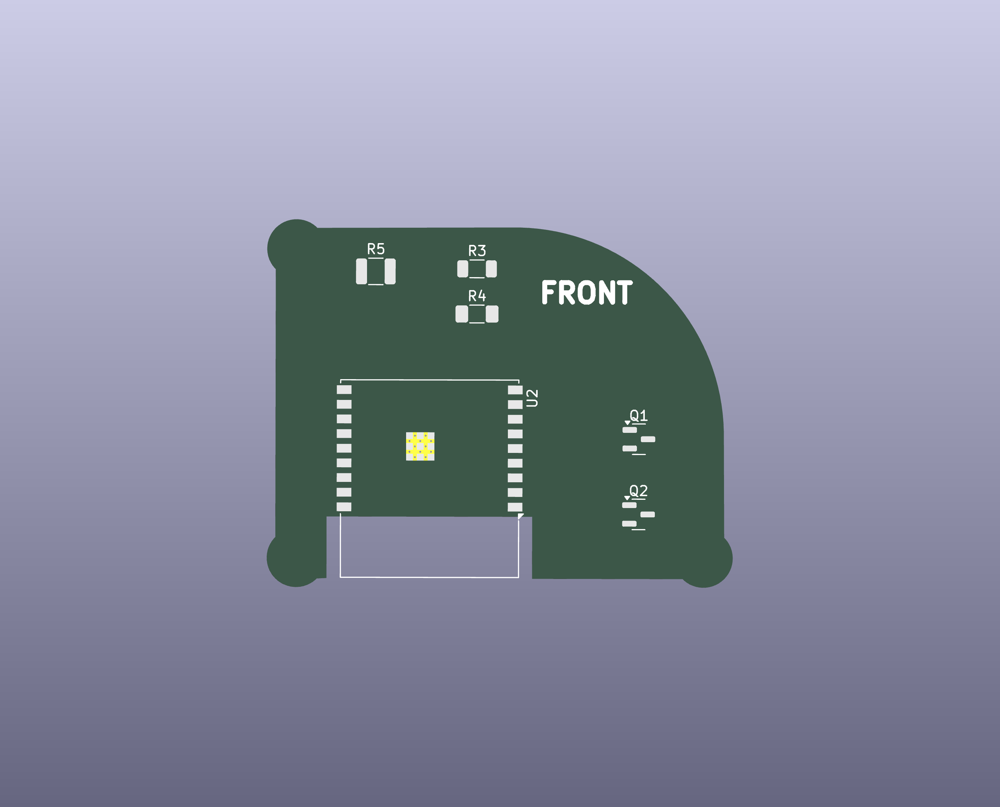
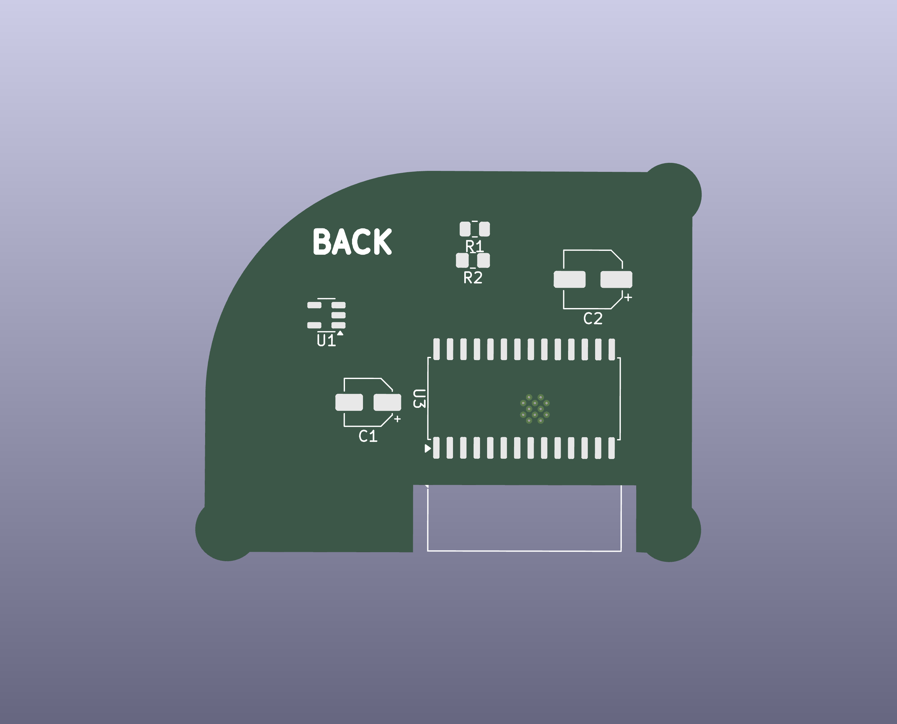
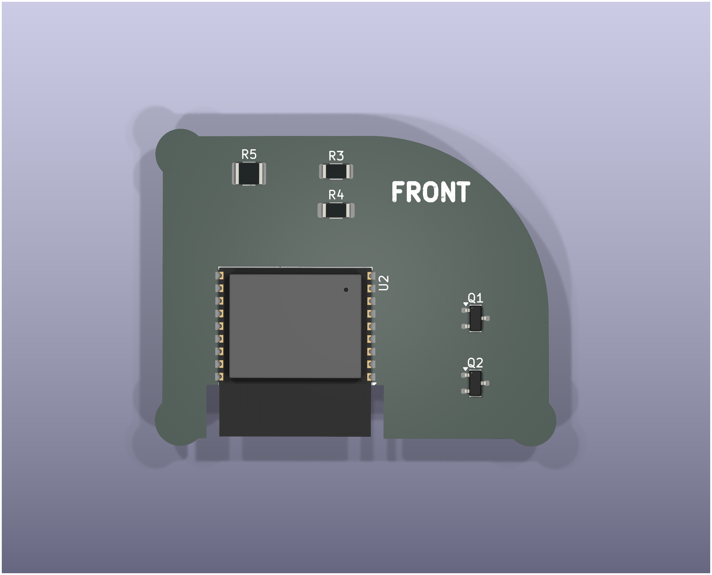
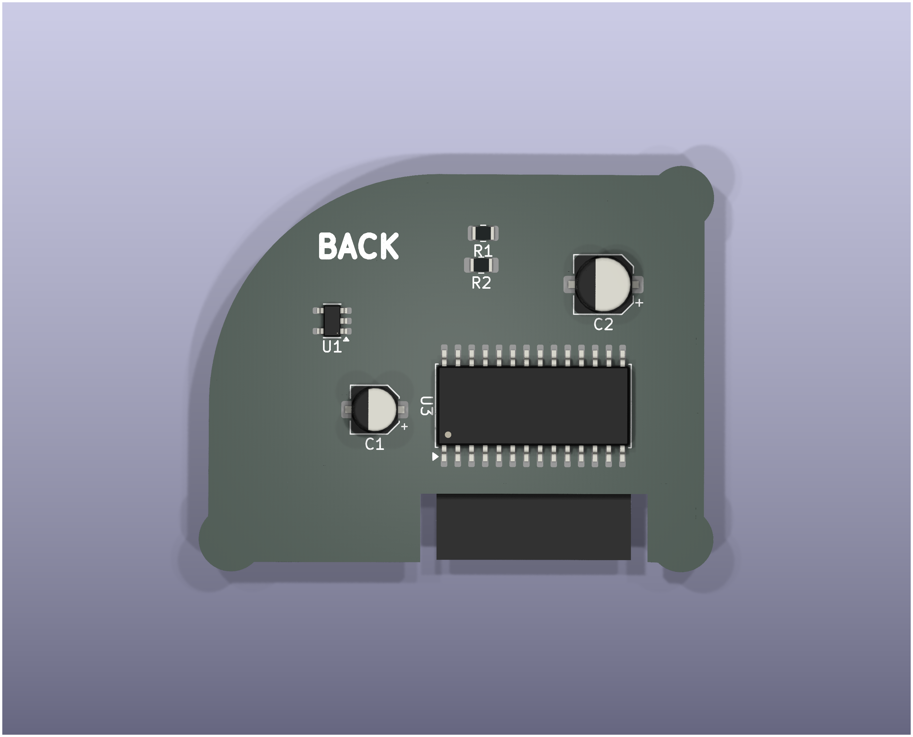
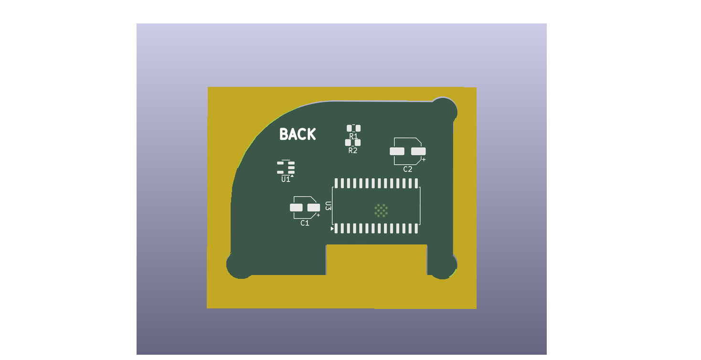

# 3DP-Stencil-Generator
KiCad 3D Printable Stencil Generator Plugin

## Acknowledgements
This repository is derived from the original work by **Leo Kuroshita** ([Hugelton](https://github.com/hugelton)), creator of the [3DP-Stencil-Generator](https://github.com/hugelton/3DP-Stencil-Generator).  
Many thanks to him for making the code available as open source.  
My contributions primarily focus on adding support for PCB outlines, refining the handling of small pads, and introducing differentiation between the front and back sides of the PCB.

## Features

- Generates a stencil frame based on the Edge.Cuts (PCB outline) or User.3 layer
- Creates pad cutouts based on SMD pads
- Adds alignment pin holes based on circles on User.2 layer
- Outputs an OpenSCAD file for easy customization and 3D printing
- Automatically opens the output folder after generation for quick access

## Installation

1. Clone or download this repository.
2. Copy the "3dp-stencil-generator" folder to your KiCad plugins directory:
   - Windows: `C:\Program Files\KiCad\share\kicad\scripting\plugins`
   - Linux: `/usr/share/kicad/scripting/plugins`
   - macOS: `/Applications/KiCad/KiCad.app/Contents/SharedSupport/scripting/plugins`

## Settings

In the `__init__.py` program you can tweak some settings to your needs.
<pre>
# === Global configuration ===
BUILD               = "128"         # Build number
workDir             = "stencil"     # Working folder name
copperSelection     = 0             # 0 = front, 1 = back
minGabBetweenPads   = 0.20          # Minimum mask width (mm) between pads
minPadSize          = 0.40          # Minimum pad size (mm) after shrinking
narrowPadThreshold  = 1.0           # Threshold for narrow pad optimization (mm)
pcbClearence        = 0.15          # PCB clearance (mm) - moves outline outward from Edge.Cuts
</pre>

## Usage

1. In KiCad PCB Editor:
  - 1.1 Draw a rectangle on User.3 layer to define the stencil frame.
  - 1.2. If no User.3 layer is present, or if it doesn’t contain a rectangle, the stencil frame is derived from the Edge.Cuts layer (+5mm in all directions).
2. In KiCad PCB Editor:
  - 2.1. Draw a rectangle on User.4 layer to define the PCB outline.
  - 2.2. If no User.4 layer is present, or if it doesn’t contain a rectangle, the PCB outline is derived from the Edge.Cuts layer.
3. (Optional) Draw circles on User.2 layer to define alignment pin positions.
4. Click the "3D Printable Stencil Generator" button in the toolbar.
    

  - A parameter dialog will appear where you can configure settings interactively

<figure style="text-align: center; margin: 0 auto;">
    
  <figcaption>Dialog to set parameters</figcaption>
</figure>

  - Changes in the Dialog will be saved and used on a "per project" basis.

   - Alternatively, you can modify the default values in the `__init__.py` file
5. The plugin will create a working directory ("/stencil" defined in the `__init__.py` program) in the same directory as your PCB file and then generate an OpenSCAD file in that directory.
   - The stencil folder will automatically open in your file explorer after generation
6. Open the generated OpenSCAD file to customize parameters if needed.
7. Render and export the stencil as an STL file for 3D printing.

## Galery

<figure style="text-align: center; margin: 0 auto;">
  
  <figcaption>Stencil for the back-side of the PCB</figcaption>
</figure>

<figure style="text-align: center; margin: 0 auto;">
  
  <figcaption>Stencil for the front-side of the PCB</figcaption>
</figure>

<figure style="text-align: center; margin: 0 auto;">
  
  <figcaption>Front side of the PCB (this side is flipped when in the stencil)</figcaption>
</figure>

<figure style="text-align: center; margin: 0 auto;">
  
  <figcaption>Back side of the PCB (this side is flipped when in the stencil)</figcaption>
</figure>

<figure style="text-align: center; margin: 0 auto;">
  
  <figcaption>Front side of the PCB with components</figcaption>
</figure>

<figure style="text-align: center; margin: 0 auto;">
  
  <figcaption>Back side of the PCB with components</figcaption>
</figure>

<figure style="text-align: center; margin: 0 auto;">
  
  <figcaption>Stencil with PCB (Front side is downwards)</figcaption>
</figure>

## Contributors

- [mrWheel](https://github.com/mrWheel) - Added Edge.Cuts support, GUI dialog, and advanced pad spacing algorithms
- **Leo Kuroshita** ([Hugelton Instruments](https://github.com/hugelton)) - Original author and maintainer

## License

This project is licensed under the MIT License. See the [LICENSE](LICENSE) file for details.
